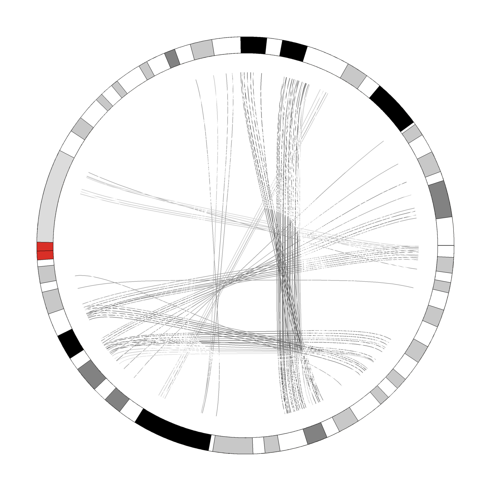
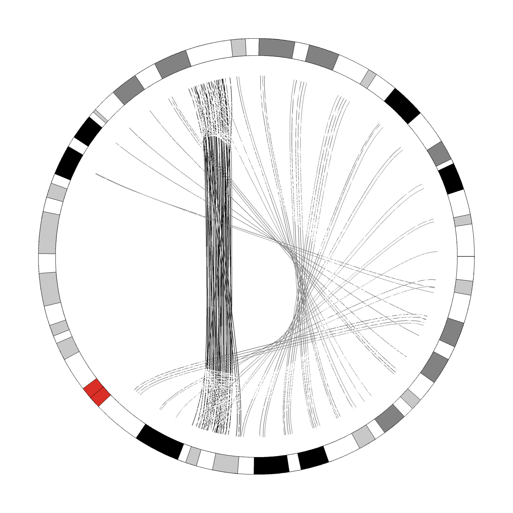
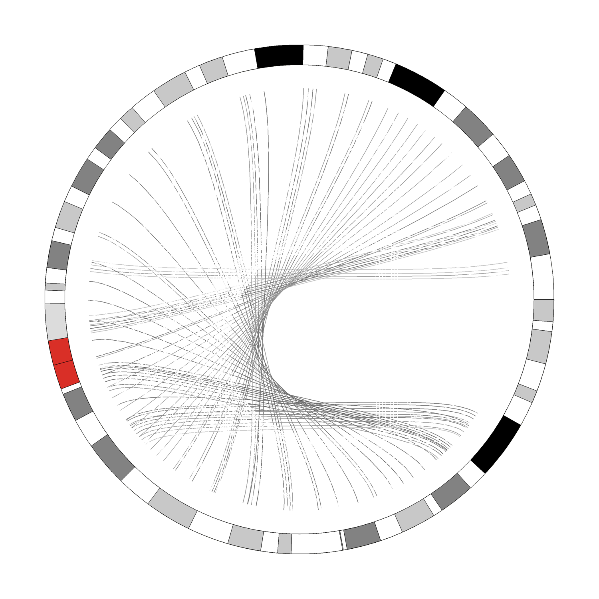

# Figlet to Circos Plots

Basically the same idea as https://github.com/erasche/figlet2gff3, except for circos links.

## Building

I've provided `primitive`, but if you're not on linux-amd64, you will need to
[compile it yourself from my PR](https://github.com/fogleman/primitive/pull/53), until that gets merged.

Once that's ready, simply stick your ≤24 character phrase in `build.sh` and run it.

## Dependencies

- primitive (as above, from my branch)
- imagemagick
- docker

## Gallery

These are extremely light-weight because I didn't feel like waiting a huge
amount of time for the tool to run. You should re-run with higher thresholds.

## LICENSE

GPL-3.0
